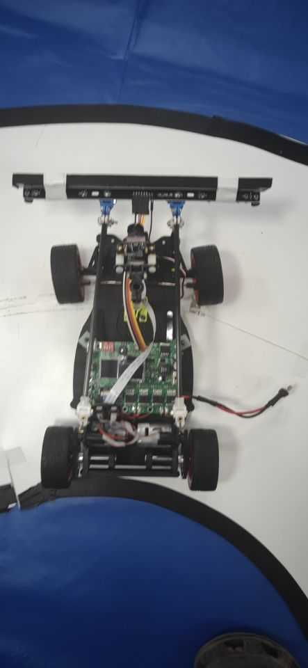

# NXP14thCyberCarRace

Hardware : MK60Z512VLQ10

2019 East China Division, Second Prize. 

However, this is a really bad code and performs not so good during competition. In our lab it can stably cross the island and barricades. The condition in our lab is too distinct with the competition environment thus the result of our competition is bad. We only finish the whole contest reluctantly. The code of the hardware part is referenced from Shanwai & Zhufei.

Since I quickly deleted the IAR workspace, the code is not the final version.